<div align="center">

<!-- Animated hero -->


<a href="https://github.com/durgeshsuthar0">
  
</a>

<br />

<a href="https://github.com/durgeshsuthar0">
  
</a>
<a href="https://github.com/durgeshsuthar0?tab=repositories">
  
</a>
<a href="https://www.linkedin.com/">
  
</a>

</div>

---

## 👋 About me

```ts
const durgesh = {
  role: "Software Developer",
  specialization: "React / Next.js",
  frontend: ["React", "Next.js", "TypeScript", "JavaScript", "HTML", "CSS"],
  backend: ["Node.js", "REST APIs"],
  ui: ["PrimeReact", "Responsive Design", "Design Systems"],
  interests: [
    "Frontend architecture",
    "Performance",
    "Reusable components",
    "Developer experience",
    "Product-focused UI"
  ],
  mindset: "Simple architecture. Excellent UX. Production-ready code."
};
```

I build **production-oriented web applications** with a strong focus on scalable frontend architecture, reusable components, responsive interfaces, and maintainable code.

My current sweet spot is **React + Next.js**, backed by practical Node.js/API experience.

---

## 🧰 Tech stack

### Frontend

<p>
  
</p>

### Backend & tooling

<p>
  
</p>

### UI / engineering

<p>
  
  
  
  
</p>

---

## 🏗️ What I build

| Area | What I care about |
|---|---|
| ⚛️ React / Next.js | Component architecture, routing, rendering, reusable UI |
| 🧩 Design systems | Consistent, accessible and reusable components |
| 🚀 Performance | Fast loading, efficient rendering and practical optimization |
| 📱 Responsive UI | Interfaces that work across desktop, tablet and mobile |
| 🔌 APIs | Clean API integration, data flow and error handling |
| 🧠 Architecture | Maintainable structure that can scale with the product |
| 🛠️ Developer Experience | Clear conventions, reusable utilities and automation |

---

## 🚀 Featured engineering work

> Replace the repository names below with your 3–5 strongest public projects.

### 📸 Photographer Event Platform
A full-stack event photography platform with event management, large-scale photo uploads, QR-based event access and face-recognition-powered photo discovery.

**Stack:** `Next.js` `React` `Node.js` `Python` `Face Recognition` `REST APIs`

### 🧩 Enterprise Admin Dashboard
A responsive administration system built around reusable data tables, dynamic forms, filtering, pagination, dialogs and API-driven modules.

**Stack:** `React` `PrimeReact` `Node.js` `REST APIs`

### ⚡ Frontend Architecture Experiments
A collection of practical experiments around reusable React components, hooks, state management, responsive UI and modern Next.js patterns.

**Stack:** `React` `Next.js` `TypeScript`

---

## 📊 GitHub analytics

<div align="center">




<br /><br />


</div>

---

## 🐍 Contribution activity

<div align="center">


</div>

---

## 💡 Engineering principles

```text
01. Prefer simple architecture over unnecessary abstraction.
02. Build reusable components, not repetitive screens.
03. Treat responsive design as a requirement, not an enhancement.
04. Keep UI state predictable and data flow explicit.
05. Optimize after measuring, not guessing.
06. Write code that another developer can understand quickly.
07. Build for the product, not just the framework.
```

---

## 📈 Currently improving

- Advanced **Next.js architecture**
- Scalable **React component systems**
- TypeScript for large frontend codebases
- Frontend performance and rendering strategies
- Better UI/UX engineering
- AI-assisted development workflows

---

## 🤝 Let's connect

<div align="center">

<a href="https://github.com/durgeshsuthar0">
  
</a>
<a href="https://www.linkedin.com/">
  
</a>

</div>

<br />

<div align="center">

### 💬 Open to building interesting products with great teams.


</div>
